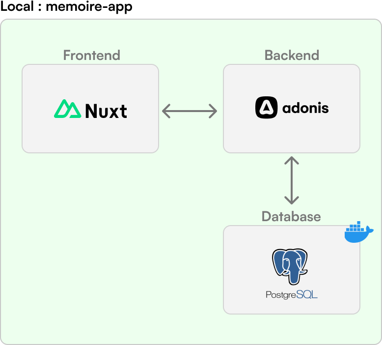
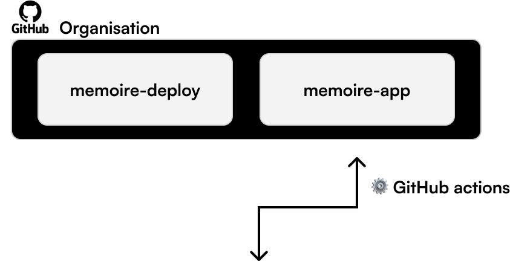
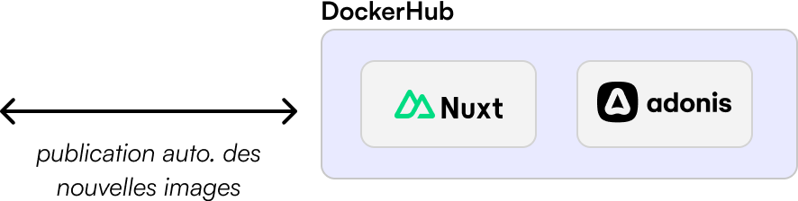
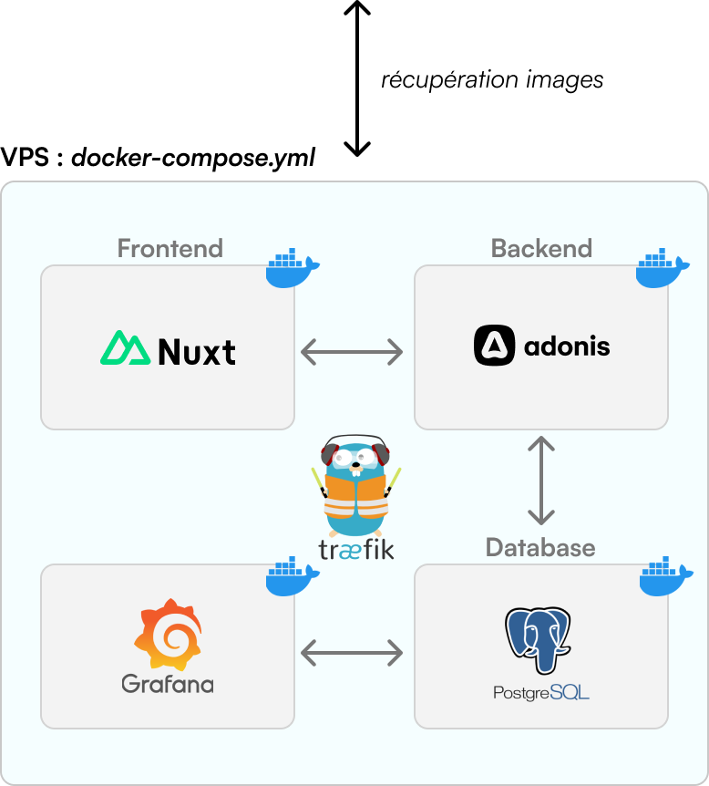
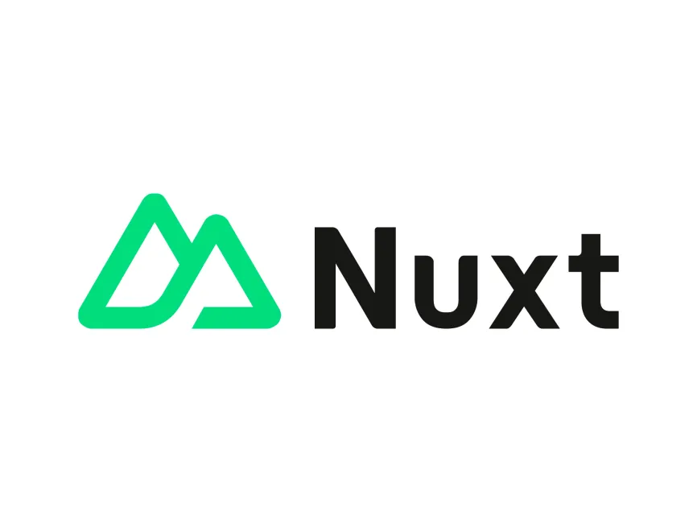
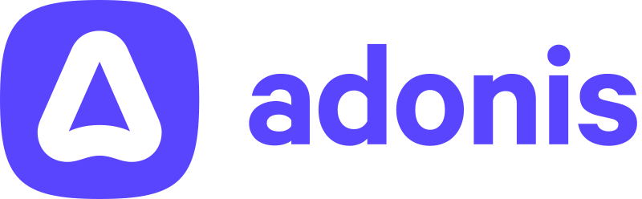

---
# You can also start simply with 'default'
theme: default
# some information about your slides (markdown enabled)
title: memoire

drawings:
  persist: false
transition: slide-up
mdc: true
hideInToc: true
---

 |
memoire

Présentation M1 Informatique

  Rémi Saurel 

 13 octobre 2024 

<!--
Bonsoir à tous et merci pour l'invitation.
-->

---
layout: image-right
transition: slide-left
---

# memoire, c'est quoi ?

<ul class='text-xl'>
  <li v-click>🃏 Application web de flashcards</li>
  <li v-click>💻 Open Source</li>
  <li v-click>🔬 Basée sur les résultats de la recherche en EIAH</li>
  <li v-click>😎 Des technos cool </li>
</ul>

  <SlideCurrentNo />

<!--
NOTES
-->
---
layout: content
transition: slide-left
---
# 🏭 Architecture globale

  

    
  

  

    
  

  

    
  

  

    
  

  <SlideCurrentNo />

---
layout: content

---

# 🤖 Technologies

  

     💻 Développement 
    
 
      
      
      
    
 
  

  

     🎨 UX/UI 
    
 
      
    
 
  

  

     ⚙️ Divers 
    
 
      
      
      
    
 
  

  <SlideCurrentNo />

---
layout: default
---
# Du coup faut faire quoi ?

### Pleins de choses
Genre ?
### Encore plus

  <SlideCurrentNo />

---
layout: two-cols
---

# 🚀 Tester `memoire`

::right::

# 👋 Rejoindre le Discord

