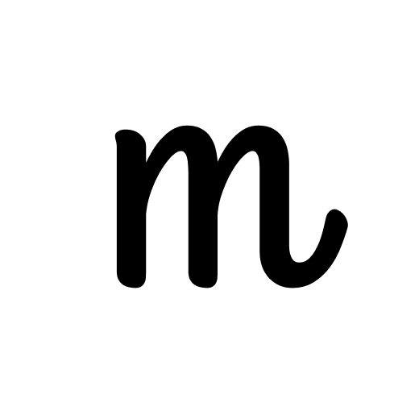
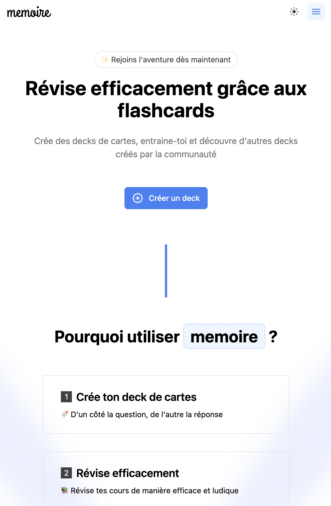
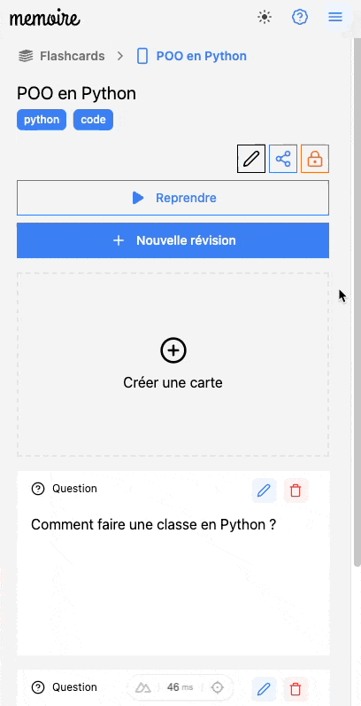
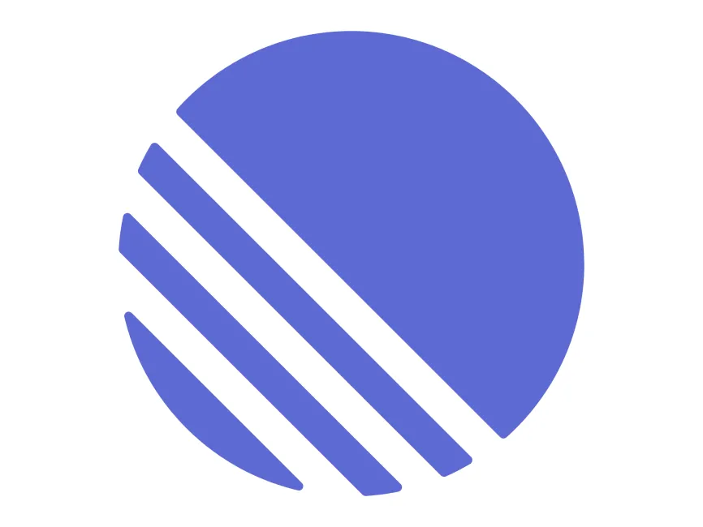
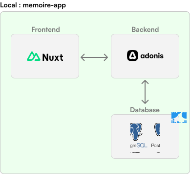
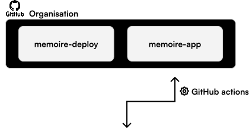
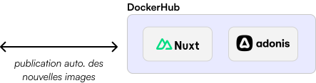
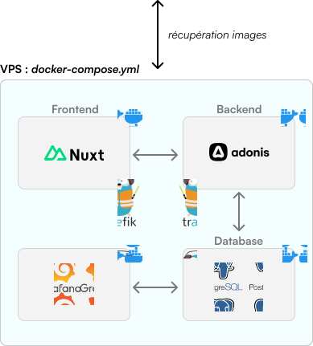

---
# You can also start simply with 'default'
theme: default
# some information about your slides (markdown enabled)
title: memoire

drawings:
  persist: false
transition: slide-up
mdc: true
hideInToc: true
---

 |
memoire

Présentation M1 Informatique

  Rémi Saurel 

 13 octobre 2024 

<!--
Bonsoir à tous et merci pour l'invitation.
-->

---
layout: image-right
transition: slide-left
---

# `memoire`, c'est quoi ?

<ul class='text-xl'>
  <li v-click>🃏 Application web de flashcards</li>
  <li v-click>💻 Open Source</li>
  <li v-click>🔬 Basée sur les résultats de la recherche en EIAH</li>
  <li v-click>😎 Des technos cool </li>
</ul>

  <SlideCurrentNo />

<!--
NOTES
-->
---
layout: default
transition: slide-left
---
# 🏭 Technos / Architecture

  

     UX/UI    
    
  

  

     Gestion projet   
    
  

  

    
  

  

    
  

  

    
  

  

    
  

  <SlideCurrentNo />

<!-- 
Technos récentes mais suffisamment stable pour des projets sur le moyen-long terme mais aussi pour le marché du travail. 
-->
---
layout: default
---
# 🤯 Plusieurs sujets disponibles

  Liste non exhaustive
  

  <ProjectCard v-click>
    <template #icon>
      🎮
    </template>
    <template #title>
      Gamification
    </template>
    <template #tags>
      <Tag v-for='tag in ["Design", "Dev", "Archi"]' :key='tag' :content='tag' />
    </template>
    <template #description>
      Basé sur les recommendations de la recherche : ajout de badges, gestion d'amis, expérience de révision, etc.
    </template>
  </ProjectCard>
  <ProjectCard v-click>
    <template #icon>
      🤖
    </template>
    <template #title>
      LLM & création de contenu auto.
    </template>
    <template #tags>
      <Tag v-for='tag in ["IA", "Dev", "Design"]' :key='tag' :content='tag' />
    </template>
    <template #description>
      Utilisation de LLM et IA (<code>Mistral</code>++) pour générer des flashcards (avec un agent ?)
    </template>
  </ProjectCard>
  <ProjectCard v-click>
    <template #icon>
      📱
    </template>
    <template #title>
      Prototype app mobile
    </template>
    <template #tags>
      <Tag v-for='tag in ["Dev", "Design", "Mobile"]' :key='tag' :content='tag' />
    </template>
    <template #description>
      Prototype app mobile : Swift / Kotlin OU React Native, (connexion facile avec le backend / API)
    </template>
  </ProjectCard>
  <ProjectCard v-click>
    <template #icon>
      😄
    </template>
    <template #title>
      Divers
    </template>
    <template #tags>
      <Tag v-for='tag in ["Dev", "Archi", "Design"]' :key='tag' :content='tag' />
    </template>
    <template #description>
      Création de contenu, gestion d'échéances, gestion de l'import, mode collaboratif (multijoueur)
    </template>
  </ProjectCard>

  <SlideCurrentNo />

<!-- 
NOTES
-->

---
layout: default
---

# 👋 Merci à tous

N'hésitez pas à venir échanger pour en savoir plus sur le projet !\
\
Discord : @remisaurel\
Mail : saurel@protonmail.com

  
  memoire.cloud

  

    🚀 Tester l'app
    
  

  

    
✍️ Rejoindre le Discord dédié à 

    
  

